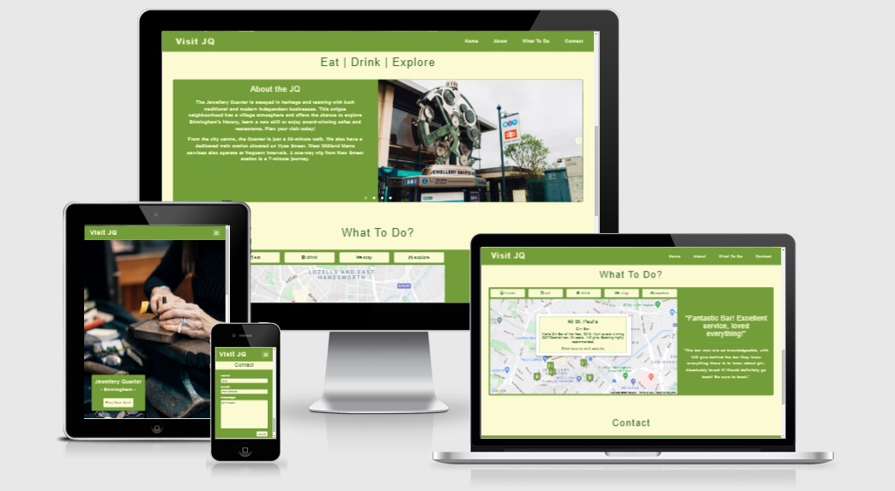
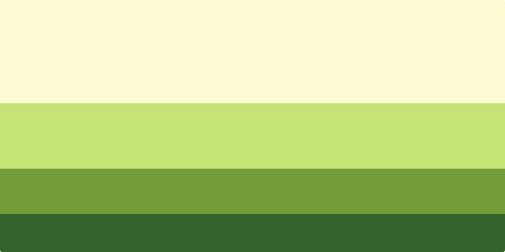

# Visit JQ

### Milestone Project Two

Visit JQ is an interactive website aimed at encouraging people to venture out of central Birmingham to discover what the Jewellery Quarter has to offer. The JQ (as locals call it) is seen as a bit of a hidden gem, located just a stone’s throw away from the hustle and bustle of the city centre with a flourishing food and drink scene. This combined with the area’s industrial roots and being Birmingham’s central creative hub makes the JQ well worth a visit.

## Demo

The live site can be viewed here - [Visit JQ](https://mitchdavenport88.github.io/VisitJQ/).

GitHub repository can be viewed here - [mitchdavenport88/visitJQ](https://github.com/mitchdavenport88/visitJQ).

## UX

### Strategy
The aim of the website is to create a user friendly website that’s shows potential visitors information about the Jewellery Quarter in a clear and intuitive manner. Visit JQ will provide the user with information and recommendations in order to entice people away from the city centre and support more local, independent businesses as well as this local community.

This website will be aimed at potential visitors who maybe new to the area and have never visited or even thought of visiting before. And then those who may know the area maybe have visited but are looking to visit again and explore it further. Either way the target audience share a common end goal. 

Reasons for the site:
* Aim to increase the amount of visitors by encouraging people to visit or to return.
* Provide a snapshot of the variety that the JQ has to offer - there is something for everyone!
* Be a guide to the area, giving recommendations on where to go and what to see. 
* To be informative and provide useful information.
* Promote and support local, independent businesses.
* Be a point of contact for potential visitors. This can be via social media or by a contact form on the site.

### User Stories 
As a user I'd like:
* The site to be easy to navigate around.
* To be able find what I’m after quickly.
* To get a better understanding about the area to gauge whether it’s worth visiting.
* Recommendations of what to do, where to go and where to stay.
* Find further information on recommendations easily, so I can decide on whether they’re suitable.
* To find out where places are.
* To be able to get in touch with someone if I have any questions.
* To do all of the above regardless of what device I am using.

As the site owner, I'd want:
* An easy to navigate, responsive site.
* A well-presented and visually appealing product that gives users the feeling they can trust the content.
* To give people reasons to visit. I can do this by providing a wide range of options of what to do, where to go and where to stay, catering for a wide audience.
* To show relevant information on my recommendations. This information is to be clear and informative.
* To provide useful information in a concise, intuitive manner that keeps the user engaged and likely to return.
* To be easily contactable.

### Scope - Functionality (must meet all)
* The site must be easy to navigate around.
* Present clear and concise information, which is visually appealing.
* We want the user to remain engaged throughout use so must be user-friendly.
* Function as expected:
    * Fully responsive on all devices.
    * External links must open in new windows.
    * Logo is also a link to home / landing page.

### Scope - Content (in order of priority)
* An about section / sections that tell and show the user what the JQ has to offer.
* Recommendations. Show these in a visual and interactive way using JavaScript to create clickable features that increase engagement. 
* Contact section. Messages could be sent either using EmailJS or contact can be made via social media.
* Give additional information on recommendations – websites, reviews and descriptions.
* Show a local weather forecast using a weather API as part of the about section.

### Structure
Based on the information gathered during the scope the website will require just one page, with each section filling the page horizontally and following one another vertically. The basic structure of the page will be as follows:
* Fixed navigation bar at the top with the Visit JQ logo and links to each section of the page. This will be accessible at all times.
* Body (split into four sections):
    * Home / landing page with a hero image. 
    * An about section with the tagline - Eat | Drink | Explore. 
    * What to do? This section will feature the google Maps API and will show our recommendations of what to do and where to eat and drink. 
    * Contact section will be a contact form, which will send the message via the Email.JS API.
* Footer with social media links and copyright notice.

### Skeleton

Initial idea - [sketch](https://github.com/mitchdavenport88/VisitJQ/blob/master/readme-docs/wireframes/wireframe-sketch.jpg).

Home wireframes - [desktop](https://github.com/mitchdavenport88/VisitJQ/blob/master/readme-docs/wireframes/home%20(desktop).png) | 
[tablet](https://github.com/mitchdavenport88/VisitJQ/blob/master/readme-docs/wireframes/home%20(tablet).png) | 
[mobile](https://github.com/mitchdavenport88/VisitJQ/blob/master/readme-docs/wireframes/home%20(phone).png).

About wireframes - [desktop](https://github.com/mitchdavenport88/VisitJQ/blob/master/readme-docs/wireframes/about%20(desktop).png) | 
[tablet](https://github.com/mitchdavenport88/VisitJQ/blob/master/readme-docs/wireframes/about%20(tablet).png) | 
[mobile](https://github.com/mitchdavenport88/VisitJQ/blob/master/readme-docs/wireframes/about%20(phone).png).

To do wireframes - [desktop](https://github.com/mitchdavenport88/VisitJQ/blob/master/readme-docs/wireframes/map%20(desktop).png) | 
[tablet](https://github.com/mitchdavenport88/VisitJQ/blob/master/readme-docs/wireframes/map%20(tablet).png) | 
[mobile](https://github.com/mitchdavenport88/VisitJQ/blob/master/readme-docs/wireframes/map%20(phone).png).

Contact wireframes - [desktop](https://github.com/mitchdavenport88/VisitJQ/blob/master/readme-docs/wireframes/contact%20(desktop).png) | 
[tablet](https://github.com/mitchdavenport88/VisitJQ/blob/master/readme-docs/wireframes/contact%20(tablet).png) | 
[mobile](https://github.com/mitchdavenport88/VisitJQ/blob/master/readme-docs/wireframes/contact%20(phone).png).

### Surface

As this is a single page design each section will fill the page horizontally and follow one another vertically as stated in the structure. This will remain the case at all responsive breakpoints. The navigation menu will be fixed at the top of the page and will house the websites logo and links that scroll the page up or down to any other section meaning links to each section will be accessible at any point. 

Each section will follow a similar layout of title then content. The content will be placed on a background of block colour in order to lift the section contents off the page and add a bit of segregation whilst making it a bit more visually appealing. A footer of similar aesthetic to the navigation menu will be at the bottom of the page housing social media links (via icons) underneath the contact section. This is where a user would expect to find these.

I want the imagery used throughout to be a nod to the creativity closely associated with the area. The JQ has a strong industrial link with the manufacture of Jewellery (hence the name) so I want my hero image to echo this, which is why I’ve selected [this image.](assets/images/jq-background-image.jpg) Also the darkness of the image contrasts nicely with the green palette I’m using. The other images I plan on using will be in the about section and will represent each eat, drink, explore titles. These will also be a nod to the creativity associated with the JQ.

I’ve visited the JQ a number of times in the past I found that green was quite synonymous with the area. A lot of doors and window frames are painted this colour and even the Chamberlain clock (a local landmark) is green. So with this in mind I found a palette using [ColorHunt](https://colorhunt.co/) to represent this. As a result I will use a combination of #FBFAD3 (light green), #729D39 (medium green) and #36622B (dark green) throughout. I plan on using Arial as my main font due to its versatility. I think it looks good bold, regular and light and when a small amount of letter spacing is applied produces clean, professional looking text.

## Features

<!-- ### Page Layout
### Navigational
### Home / landing
### About | Eat | Drink | Explore
### What to do?
### Contact -->

### Features left to implement
* Show a local weather forecast using a weather API as part of the about section. I had this as part of my original scope but at the bottom in terms of priority. This will be implemented underneath the about section using a API such as [Weatherbit.](https://www.weatherbit.io/api)
* An about Visit JQ page - providing service and company information.
* Gallery - linked up to a Instagram account.
* Newsletter subscription built into the contact form or as a pop up modal.

## Technologies
* HTML & CSS.
* JavaScript.
* Gitpod (IDE).
* Git, [GitHub](https://github.com/) and [GitHub Pages](https://pages.github.com/). Used for version control, hosting my repository and hosting my site.
* [Balsamiq.](https://balsamiq.com/) Program used for drawing the wireframes.
* [Bootstrap 5.](https://getbootstrap.com/) Grid layout, responsive design and basic styling.
* [Favicon.io.](https://favicon.io/) Created favicon's, which are visible in browser tabs and the bookmarks bar.
* [Font Awesome.](https://fontawesome.com/) Adds icons throughout the site to increase UX.
* [Google Maps JavaScript API.](https://developers.google.com/maps/documentation/javascript/overview) API used to render a google map on my site. I used built in features such as markers and infowindows to provide additonal information. 
* [Custom map markers.](https://mapicons.mapsmarker.com/) Used to generate and download custom map markers that match the sites aesthetic.
* [Email.JS.](https://www.emailjs.com/) Connects the contact form to a email service. EmailJS uses the data inputted into the form to generate and send an email using a combination of JavaScript and a custom template. 
* [TinyPNG.](https://tinypng.com/). Reduces file size of the image files used. 
* [Am I responsive?](http://ami.responsivedesign.is/) Gives a visual representation of how the website looks on different devices. Also used to produce the mock-up shown above.
* [AutoPrefixer.](https://autoprefixer.github.io/) Adds vendor prefixes to CSS code for use on additional browsers.

## Testing
Separate testing document can be found here - [testing documentation.](TESTING.md)

## Deployment

### Adding and committing files
I’ve been using Gitpod to write my code and using the terminal to add, commit and push code from my workspace to 
GitHub where it is stored remotely as shown in the course content. 
1. Typing `git add` into the terminal will move files to the staging area. You should normally do this once a couple of minor additions or changes have been made or one large change or addition has been made. `git add .` will add all files that have been modified, the full stop here means all. If I want to be more selective I can type in the file name e.g. index.html or the files pathway e.g. assets/css/style.css instead of the full stop e.g. `git add index.html`.
2. To send these changes to the local repository we use `git commit`. Normally you'll want to include a brief description of these changes so instead use `git commit –m “ ”`. Between the “ ” write a clear, concise message detailing what this commit has done.
3. To view any changes on GitHub pages or when you want to send your work to a remote repository (GitHub in this instance) then use the `git push` command. This pushes all the previous commits made to the remote repository. When GitHub Pages is set up for the repository it will automatically pick up these changes and display the most up to date version that has been pushed. 

### GitHub Pages deployment
This site is hosted by GitHub pages and was deployed from the master branch of its GitHub repository. The following steps were taken to deploy this project:
1. Log in to GitHub and navigate to the chosen repository.
2. Select **settings** from the menu that is near the top of the page.
3. From the options menu on the left of the screen select **pages**. You can also scroll down to the GitHub Pages section near the bottom of the page and click the link.
4. Under the sub-heading **source** change the drop down menu that reads none so it reads Branch:master. Click save.
5. The page will refresh, this means it was successful. Note that changes will take a while to take effect.
6. To retrieve the link go back to the GitHub Pages section, repeating step 3 where it will be displayed.

### Cloning
You can clone a repository so that it can be worked on locally in an IDE such as VSCode by following these steps:
1. Log in to GitHub and navigate to the repository you wish to clone.
2. Click the button that reads **code**. This button is situated to the left of the green Gitpod button near the top of the page.
3. To clone the repository using HTTPS, copy the link shown whilst HTTPS is selected. The link will look something like this: `https://github.com/YOUR-USERNAME/YOUR-REPOSITORY`
4. Open your local IDE and in the terminal navigate to the working directory of where you wish to insert the cloned directory.
5. Type `git clone` followed by the link you copied in step 3 into the terminal, this will look something like this: `git clone https://github.com/YOUR-USERNAME/YOUR-REPOSITORY`
6. Press **enter** and the clone will be created in your selected / current working directory (cwd).

Taken from GitHub's documentation on cloning, which can be found 
[here.](https://docs.github.com/en/github/creating-cloning-and-archiving-repositories/cloning-a-repository#cloning-a-repository-to-github-desktop)