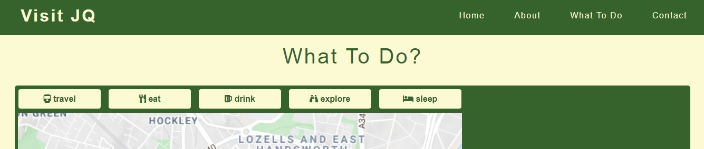

# Milestone Project Two - Testing

The live site can be viewed here - [Visit JQ.](https://mitchdavenport88.github.io/VisitJQ/)

[Back to README file.](README.md)

## Testing
My code has been put through the following:
* CSS AutoPrefixer.
* W3C HTML validation - passed on second attempt.
    * On the first attempt one warning was found, this was that "The type attribute is unnecessary for JavaScript resources" refering to the `type="text/javascript"` attribute in my EmailJS script. As a result I deleted this.
* W3C CSS validation - passed.  
* JSHint JavaScript validation:
    * map.js:
        * Reports two unused variables. initMap() is called by the google maps script in index.html on load. The other is dropMarkers(), which is called by the onclick eventListener attached to the map buttons.
        * Reports three undefined variables. Two of these jewelleryQuarterPlaces and placeIcon are defined in database.js the other, called google is used by the map API to load. 
    * database.js - Reports two unused variables. These variables (jewelleryQuarterPlaces and placeIcon) are called in map.js.
    * script.js - no issues reported other then unnecessary semicolon's, all of which have been removed.
    * sendEmail.js:
        * Reports one undefined variable. The emailjs variable is used by the EmailJS API and given as part of thier documentation to successfully send the contact form via email as expected.
        * Three warnings that user_name, user_email and message would be better written in dot notation. I've chosen to ignore these as they are used to identify the input fields by using thier name attribute and using an underscore is seen better practice in HTML.

## Functionality
### Manual Testing
These are the steps I went through testing my website and it's functionality.

Navigation:
1. Clicked on all links in the navigation to ensure they take me to the right section.
2. Clicked the logo at various points to make sure that this takes me back to the home section (scrolls the page up).
3. Hovered over the links, they should all become bold on hover. 
4. Checked the navigation bar remains at the top of the page at all times and is never hidden by any other content.
5. Changed the window width to below 992px in order to check that the navigation bar content changes. A menu icon should be displayed to the right and all links should now display via a dropdown menu only. 
    * The Visit JQ logo should always be positioned top left.
6. Toggled the menu icon button on/off to check it displays and hides the dropdown menu accordingly. Links to the other sections should be shown in this dropdown menu.
7. Repeated step 1 but using the dropdown menu only.
    * The dropdown menu should close once a link has been clicked.

Home / landing:
1. Checked that the background image isn't pixelated and loads 100vh.
2. Checked the text overlay box appears and that the relevant text and buttons are visible within.
3. Hovered over the "Plan Your Visit" button to check it inverts colour on hover.
4. Clicked the "Plan Your Visit" button checking the page scrolls down to the Eat | Drink | Explore section.

Eat | Drink | Explore:
1. Checked that the title of "Eat | Drink | Explore" is displayed and aligned centrally above the section.
2. Checked that on screen widths of 992px and above the carousel displays half text and half image.
    * Checked the pictures load, are positioned well and are of good quality.
    * Checked that the arrow icons load (where applicable) and that 4 indicator buttons display at the bottom.
3. Checked that on page load (irrelevant of page width) slide 1 shows and only the right arrow button displays indicating the carousel can slide this way only. 
4. Clicked the arrow buttons to check they move the carousel the intended way.
5. Checked that the relevant arrow buttons get hidden on slide 1 and 4 as the move they indicate doesn’t exist. 
    * Checked on slides 2 and 3 that arrows are displayed on both sides of the carousel.
6. Checked that the indicator buttons update in appearance dependent on the slides index, they should indicate what slide is currently been shown.
7. Clicked on each indication button. On click the carousel should move to its corresponding slide e.g. button 2 will display slide 2 and so on... 
8. Checked there are 4 slides in total.
9. Changed the window width to below 992px to check the carousel shows text only and the images get hidden.
    * Carousel content should adjust to the screen width. Text is legible and doesn’t overflow. 
10. Repeated steps 3-8.

What to do:
1. Checked that the title of "What To Do?" is displayed and aligned centrally above the section.
2. On screen widths of 992px and above all the contents of this section should be inline filling the page width.
    * Checked that the map renders. It should locate to the JQ.
    * Checked the correct buttons load above the map. Each button should have a label and an icon that relate to its function.
    * Checked that the brief introduction and explanatory text appears in the recommendation section.
3. Hovered over each of the map buttons to check they invert colour on hover.
4. Clicked on a map button.
    * A set of custom markers should appear on the map.
    * On the click of another map button the map should clear and different set of markers should appear.
    * The map should only display one set of markers at any point, as there are different sets of markers assigned to each button.
5. Clicked on a marker.
    * Map should zoom and centralise to the selected marker on the map. 
    * Checked that an info window pops up and is attached to this marker.
    * Info window should display a title, a brief description and a website link. When the link is clicked a new tab opens.
    * Checked that the recommendation section text changes to show either additional information or a reveiw related to the marker selected.
    * Checked that in instances where additional information contains links (stations) that these also open in new tabs.
    * Content should adjust to the screen width. Text is legible and doesn’t overflow.
6. Clicked another marker.
    * Checked that everything that displayed for the previous marker has been cleared off the map.
    * Repeated step 5.
7. Clicked the x in the info window, this should close the info window but all markers should remain visible. 
8. Clicked another map button.
    * Relevant marker set should appear as previously tested.
    * Checked the map view resets to its default position and default zoom.
    * Checked the recommendation section text also resets to its default content.
9. Changed the window width to below 992px in order to check the map and its buttons fill the screen width.
    * The recommendation section should drop underneath the map.
10. Repeat steps 4-8.

Contact:
1. Checked that the title of "Contact" is displayed and aligned centrally above the section.
2. Checked the number of input fields, 3 in total: name, email and message. Each having a relevant label.
3. Hovered over the send button to check it inverts colour on hover.
4. Tested that the form validated the inputted data correctly. In all the following instances a red message box should appear above the form with the text “Please ensure all fields are correctly filled in!”.
    * Pressed the send button to try and send an empty form. Failed as all fields are required.
    * Filled in any 2 of the 3 fields with "test test test". Pressed the send button. Again failed as all fields are required.
    * Filled in all fields with "test test test". Pressed the send button. Failed as the email field requires a email address.
5. Tested the email address validation.
    * I changed the email field to "test@test" and pressed send. This would send if using the HTML required attribute but should fail in this instance as a valid email address should have a .com or .something at the end. “Please ensure all fields are correctly filled in!” message should display.
    * I also tried "@test.com", "test@test.c" and "test@test.comm". As these don't fit the pattern set in my JavaScript validation they all should fail too. “Please ensure all fields are correctly filled in!” message should display.
6. Changed email field to "test@test.com" and pressed send. The button text should now read sending...
7. A green message box should now appear and display the message: “Your message has been sent!”.
    * Checked the form has been reset, blank and ready for use again if required.
    * Checked the button text has defaulted back to send.
    * Message disappears after 6 seconds.
8. On screen widths below 768px the form layout will change with all fields becoming block and displaying on top of one another.

Footer:
1. Checked that social links display to the right and the copyright notice displays to the left.
2. Clicked all social links in the footer to check that they open and do so in a new tab.

I also posted my site in the #peer-code-review channel on Code Institutes Slack channel to get feedback from fellow students. Stefan Carter and Naoise Gaffney kindly took the time to test my front end product with no major issues being reported back. 

### Lighthouse Reports
Naoise mentioned in his feedback about doing a Lighthouse report. I had done some initial audits before submitting to the #peer-code-review, but hadn't taken any action on any of the feedback. As part of my testing I decided to look further into its results and recommmendations in order to improve my site.

Based on the results of the report I made the following changes:
* In order to improve the SEO I added a meta description into my header section.
* To improve the sites accessibility I added an `aria-label` attribute to all my buttons so they work better with screen readers.
* It was bought to my attention that my colour scheme did not have a sufficient contrast ratio. I was originally using a light green (#FBFAD3) on top of a medium green (#729D39) background, I thought this contrast was enough but it was only been given a contrast rating of 2.99. I read further into this and found that ideally we'd want a contrast ratio above 4.5. As a result I decided to tweak my color scheme in order to improve accessibility. I swapped the medium green (#729D39) for a darker green (#36622B), which was part of my planned colour palette to get a final contrasr ratio of 6.71. This is much improved. 

    [Before the change (contrast ratio 2.99) screenshot.](readme-docs/screenshots/amiresponsive-image.jpg)

    [After the change (contrast ratio 6.71) screenshot.](readme-docs/screenshots/amiresponsive-image-2.jpg).

* I added `loading = "lazy"` attributes to the `` tags used in order to improve performance as the report recommended to "Defer offscreen images". On smaller devices the carousel only displays text. The images that are displayed on larger devices aren't used but were still being loaded and this was slowing the loading process down. I read about [lazy loading here](https://www.sitepoint.com/five-techniques-lazy-load-images-website-performance/#:~:text=%20Five%20Ways%20to%20Lazy%20Load%20Images%20for,and%20easy%20alternative%20for%20implementing%20lazy...%20More%20) and found that the `loading` attribute allows us to delay images from being loaded until they're required. This removed the warning.
* To improve the security of my site I added `rel="noreferrer"` to all links that use `target="_blank"` [as shown here.](https://web.dev/external-anchors-use-rel-noopener/?utm_source=lighthouse&utm_medium=devtools) This attribute prevents two things:
    * Prevents the new page from being able to access the window.opener property as "noreferrer" runs in a separate process.
    * It also prevents the referer header from being sent to the new page.
    
This shows the impact of these changes:

## Responsiveness
Whilst building my site I have been checking my progress and changes using Chrome DevTools at different breakpoints. I also make a habit of regularly pushing my work to GitHub, so I can physically see the live site on both my desktop and iPhone via GitHub pages. I do this at varying stages of the build and especially when new features get added, as I find physically seeing something more beneficial than a projection on DevTools. This also gives me a better feel of how it works.

I have tested for responsiveness on other devices using DevTools along with the Responsive Design Mode on Firefox and the Inspect tool on Microsoft Edge. Using these tools I have tested on numerous mobile devices such as the Moto G4, Galaxy X9 and the iPhone range as well as numerous tablet devices in both landscape and portrait views.

## Browser Compatibility
I have physically tested my website by completing the manual testing plan on the following browsers and devices:
* Chrome (desktop and iPhone).
* Firefox (desktop and iPhone).
* Safari (desktop and iPhone).
* Microsoft Edge (desktop only).
 
I also tested compatibility at varying screen sizes to test the responsiveness on each Browser using Chrome DevTools along with the Responsive Design Mode on Firefox or the Inspect tool on Microsoft Edge. Issues that occurred during this testing are documented in the bugs & fixes section.

## User Stories
### As a user / site owner I'd like:
* **"The site to be easy to navigate around."** 
* **"An easy to navigate, responsive site."**
    * I've used a fixed navigation bar so that the page links are available at the top of the page at any point of use as shown in the image below.
    * This is also the case on smaller devices but the links get placed into a dropdown menu, which is operational by clicking the menu button [as shown here.](readme-docs/screenshots/user-story-screenshots/user-story1-screenshot2.jpg)

  
* **"To be able to find what I’m after quickly."**
    * The fixed navigation bar mentioned above aids with this.
    * Each section is clearly titled and separated by these titles. The sections also appear on contrasting block colour backgrounds adding further distinction [(as shown here)](readme-docs/screenshots/user-story-screenshots/user-story2-screenshot.jpg).  
    * I've also tried to keep each section as concise as possible, meaning if a user were to scroll down the page they wouldn't have to scroll far to find what they're after.

* **"To find out where places are."**
    * My "What To Do?" section uses the Google Maps API to display the recommendations, showing users where specific places are on a map.
    * The map works just as it would if it was accessed via Google with the controls being the same. The map has been tailored for showcasing the JQ area throughout use. 

* **"Recommendations of what to do, where to go and where to stay."**
* **"To give people reasons to visit. I can do this by providing a wide range of options of what to do, where to go and where to stay thus catering for a wider audience."**
    * As you can see from the image above there are a series of buttons above the map that represent place types. When one of these buttons is clicked a range of markers will drop on the map showing the places we recommend for that place type.
    * At the moment the place types are:
        * Travel - car parks, metro and train stations.
        * Eat -  cafes and restaurants.
        * Drink - pubs and bars.
        * Explore - places of interest such as museums, breweries and live music venues.
        * Sleep - apartments, hotels and hostels.
    * I've tried to include a wide range of venues and activities to cater for a wider audience.
    * I've used an object in my JavaScript to hold this information. This makes it easy to maintain, meaning at a later date I could add or remove places; update marker positions if required and even add a new place type button.

* **"Find further information on recommendations easily, so I can decide on whether they’re suitable."**
* **"To show relevant information on my recommendations. This information is to be clear and informative."**
    * Each marker that is dropped is clickable. Clicking a marker will display an info window that shows additional information specific to that place. The information showed via an info window is:
        * Place name.
        * A brief description of the place.
        * A link to their website.
    * In addition to this when a marker is clicked the text in the recommendation section (shown to the right or underneath the map) is updated. This section will now contain either additional information on one of the stations for instance or contain a review of a restaurant or pub we've recommended.

* **"To get a better understanding about the area to gauge whether it’s worth visiting."**
    * I feel the carousel covers the wide diversity offered by the area.
    * Each image used (including the hero image) helps portray this too.
    * Each of the 4 slides in the carousel showcase a different aspect to the area. I've broken the information down this way as not to overload the user with a lot of information at once.
    * The information is easily accessible, displayed in a visually compact way that doesn't affect the quality of information provided.
    * The map also helps by showing where the JQ it is geographically. This can be used to see where the area is in relation to the city centre or elsewhere.

* **"To be able to get in touch with someone if I have any questions." & "To be easily contactable."**
    * An easy to use contact form can be found at the bottom of the page. This will send a message using an EmailJS template that populates using the data collected in the form. An example of a sent message can be [seen here.](readme-docs/screenshots/user-story-screenshots/user-story7-screenshot.jpg)
    * Contact can also be made via social media channels with links to these at the bottom of the page. These are located by the contact section so can be found easily if a contact form isn't their thing!     
    

* **"A well-presented and visually appealing product that gives users the feeling that they can trust the content."**
    * I like to think I have created a visually appealing site that looks like it’s been well thought through. To achieve this I've used a combination of different features throughout the page as well as using a simple colour scheme and layout that gives a clean and professional look.

* **To provide useful information in a concise, intuitive manner that keeps the user engaged and likely to return.**
    * I have provided a range of information in a number of different ways:
        * On a carousel, which is operated by button click. The content of which is informative, responsive and is displayed in a concise way. This is achieved by using a number of slides in order to break up the content up into size-able chucks as opposed to just a big block of text, which is hard going.
        * Locations of recommendations get displayed in a visual manner by using markers placed on a map to indicate their whereabouts.
        * Place specific information on the recommendations gets displayed via an info window, which is triggered by clicking on any of the marker icons. This information is also concise and doesnt take the user away from where they are on the page.  
        * Additional information that is likely to take up more screen space is shown in a separate section but still next to the map.
        * In the contact section I chose to show success, failure or validation messages based on the users input once the form gets submitted to increase interactivity with a user. 

* **"To do all of the above regardless of what device I’m using."**
    * I have done thorough browser compatibility testing as well as responsiveness testing at different breakpoints. I am confident that the site is suitable for use on a wide range of devices on the browsers tested. 

## Bugs & fixes
* I had some issues with dot notation at times. [Here’s one example.](readme-docs/screenshots/placeIcon.buttonName-issue-screenshot.jpg)
    * I wanted to put a Font Awesome icon on each button that was specific to the place type the button represented after the buttons had been generated dynamically.
    * So I created a separate object called `placeIcon`, which held the values of different Font Awesome links. Each key in `placeIcon` shared a name with the value of the `let buttonName` variable that was being created on each loop. [placeIcon can be viewed here.](readme-docs/screenshots/placeIcon-object.jpg)
    * My thinking was that I could simply use dot notation to access the keys by using buttonName e.g. `placeIcon.buttonName` as they had the same name. This didn't work.
    * I console logged the value of `placeIcon` and it returned the object as expected. I consoled logged the values of `buttonName` on each loop and that returned what I expected also - the shared names of the values [as shown here](readme-docs/screenshots/placeIcon.buttonName-console.jpg). 
    * I thought the dot notation was correct and couldnt see what the issue was. As an alternative I tried bracket notation instead whilst using the same logic... `placeIcon[buttonName]` worked.

As a result of my manual testing I found and corrected the following issues:
* As mentioned above I modified my colour scheme to improve the contrast ratio. During testing I realised that I had overlooked changing the colour of two things:
    * The links found in the recommendation section (where applicable). The links still worked but weren’t visible as they were the same colour as the background. I altered the css so the links are now #FBFAD3 and visible. [Screenshot showing this here.](readme-docs/screenshots/manual-testing-img1.jpg)      
    * The background colour of the success message that appears when a message has been sent. This was also the same colour as the background. I changed this to #729D39 as I want this message to stand out. [Screenshot showing this change here.](readme-docs/screenshots/manual-testing-img2.jpg)  

* During the testing of my contact form I found one instance where two messages appeared at once. [Screenshot showing this here.](readme-docs/screenshots/manual-testing-img3.jpg) As I want the messages to relay clear information I added `style.display = 'none';` to the function displayValidateMsg() in sendEmail.js in order to hide the success message in this situation.

* I noticed that on incredibly thin widths (below 320px) the copyright notice and the social media icons in the footer overlapped. Now at this breakpoint the copyright notice gets hidden and the social media links get centrally aligned (in the rare occasions that this occurs).

* While testing the carousel I came to the realisation that the arrow on the 1st slide was being lost in the background. [As seen here.](readme-docs/screenshots/manual-testing-img4.jpg) I resolved this issue by switching the content and images over on each slide meaning the arrows are now either up against a dark green background or a dark image. This simple switch means the carousel still runs in the same order but the arrows are much more visible making the carousel more user-friendly. 

### Webkit issue
I also found something odd during the testing of the map section on my mobile, which is an iPhone 6. When the “Click here to visit website” link is used via the Google map info window it opens in a new tab like it should… But then on my return to the page the info window surround was collapsing as shown below. 

The issue didn't occur on my desktop browser nor on any of DevTools, Responsive Design Mode or on the Inspect tool. This seemed to be only happening on iPhones as I also found the issue on my partner’s iPhone 7 also using Chrome and Safari, but when I tested on my friends Huawei P30 pro using Chrome it didn’t happen at all. I ended up speaking to my mentor about it who also tested it on his iPhone on both Brave and Safari with the same results as me. 
* [Before link was opened (iPhone).](readme-docs/screenshots/bug-iphone-before.PNG)
* [On return to the page (iPhone).](readme-docs/screenshots/bug-iphone-after.PNG)
* [On return to the page (Huawei P30 pro).](readme-docs/screenshots/bug-huawei-after.jpg)

I tried a number of things to resolve the issue such as turning off the maxWidth property I have on the window. Styling the info window in numerous ways. Re-adding the webkits using AutoPrefixer. Overriding and editing the info windows preset css styling with my own css styling, all to no avail.

After speaking to tutor support and my mentor Brian, I am putting the issue down to a peculiarity in how the browsers are handling this and that there's a bug in the browser. It was explained to me that browsers on iOS use the same rendering engine i.e. Chrome on iPhone uses Webkit (Apple’s rendering engine), which is different from Chrome on other platforms (which uses Chromium). This could point to it being a possible Webkit issue. The content that I'm putting into the info window is actually uneffected - it still displays, its still visible and doesn't get re-sized in anyway. Its just the surrounding window that's effected.